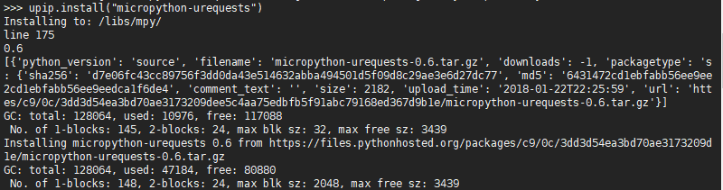
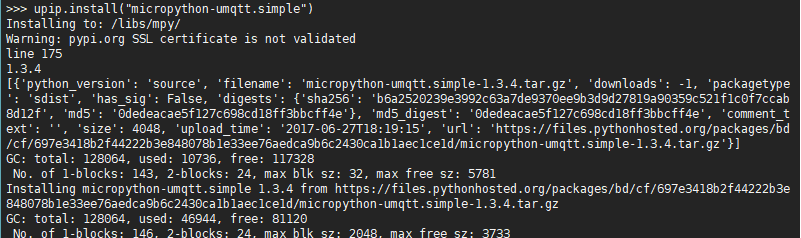

# RT-Thread MicroPython 网络编程指南

!!! abstract "简介"
    MicroPython 提供丰富网络功能，可以加快物联网项目的开发进程，本章介绍常用的网络功能以及相关模块的使用方法。

## Http Client

在这里我们需要使用的模块是 `urequests` 。

### 获取并安装 urequests 模块

获取该模块有两种方式，详细操作可参考包管理章节：

- 使用 upip 包管理工具下载。
- 从 MicroPython-lib 中复制到开发板上文件系统的 `/libs/mpy` 目录下。

如果使用 upip 工具下载，可使用 `upip.install("micropython-urequests")` 命令，下载过程如图所示：



upip 工具将自动下载并安装  `urequests` 模块，接下来我们就可以按照模块说明来使用了。

### urequests 模块的使用

下面示例程序使用 `get` 命令来抓取 `http://www.baidu.com/` 的首页信息，并按照一定格式输出：

```python
try:
    import urequests as requests
except ImportError:
    import requests

r = requests.get("http://www.baidu.com/")
print(r)
print(r.content)
print(r.text)
r.close()
```

## Http Server

如果想要使用 RT-Thread MicroPython 搭建一个 Web 服务器该怎么做呢，这时候我们可以利用 MicroWebSrv 模块来实现这一功能。

### 获取并安装 MicroWebSrv 模块 
- 首先从 `https://github.com/jczic/MicroWebSrv.git` 将相关文件克隆到本地。
- 将 `www` 文件夹拷贝到文件系统的根目录(这里将 SD 卡作为开发板文件系统的根目录)。


- 把其他文件拷贝到 /libs/mpy/ 文件夹中。


- 这样 MicroWebSrv 模块就安装好了，可以在 MicroPython 交互命令行中直接使用 `import` 命令导入了。

### MicroWebSrv 模块的使用

- 在 MSH 中，使用 ifconfig 命令查看开发板 IP 地址。
- 输入 python 命令，进入 MicroPython 交互命令行。
- 使用 import main 命令，启动 Web 服务器。


- 打开浏览器，在地址栏输入开发板 IP 地址并回车，即可看到 Web 页面。


- 输入网址 ip/test 使用表格填写示例。


- 点击 Submit，服务器返回你填写的信息。


### 服务器功能的修改

- 如果想过要通过服务器实现自己所需的功能，可以修改 main.py 文件，导入更多模块，使用 Python 语言来添加更多功能。

## Mqtt

MQTT 是一种基于发布/订阅（publish/subscribe）模式的“轻量级”通讯协议 。想要在 RT-Thread MicroPython 上使用 MQTT 功能需要安装 `umqtt.simple` 模块。

### 获取并安装 umqtt.simple 模块
同样的可以使用包管理中的两种方式来获取，使用 upip 安装的方式如图：



### umqtt.simple 模块的使用

- mqtt 订阅示例，使用 `iot.eclipse.org` 作为测试服务器
```python
import time
from umqtt.simple import MQTTClient

# Publish test messages e.g. with:
# mosquitto_pub -t foo_topic -m hello

# Received messages from subscriptions will be delivered to this callback
def sub_cb(topic, msg):
    print((topic, msg))

def main(server="iot.eclipse.org"):
    c = MQTTClient("RT-Thread", server)
    c.set_callback(sub_cb)
    c.connect()
    c.subscribe(b"foo_topic")
    while True:
        if True:
            # Blocking wait for message
            c.wait_msg()
        else:
            # Non-blocking wait for message
            c.check_msg()
            # Then need to sleep to avoid 100% CPU usage (in a real
            # app other useful actions would be performed instead)
            time.sleep(1)

    c.disconnect()

if __name__ == "__main__":
    main()
```

- 使用 python 命令执行上述代码文件，即可收到我们另一个客户端发布的主题


- mqtt 发布示例，执行如下代码后可以在订阅该主题的客户端那里收到发布的信息
```python
from umqtt.simple import MQTTClient

# Test reception e.g. with:
# mosquitto_sub -t foo_topic

def main(server="iot.eclipse.org"):
    c = MQTTClient("SummerGift", server)
    c.connect()
    c.publish(b"foo_topic", b"Hello RT-Thread !!!")
    c.disconnect()

if __name__ == "__main__":
    main()

```