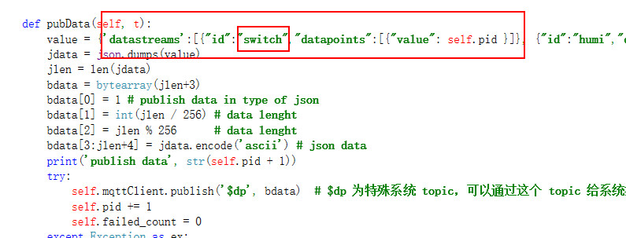
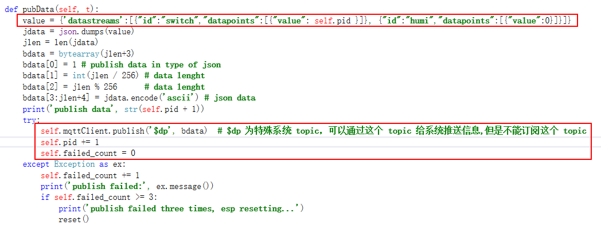

## 云平台对接(OneNET)

!!! abstract "简介"
    本节介绍如何使用 RT-Thread MicroPython 来将设备接入 OneNET 云平台，本次示例使用的接入协议为 MQTT。

## 产品创建

- 想要将开发板接入 OneNET 云平台，首先要进行产品的创建，创建分为两步，第一步是注册一个用户账号，第二步是创建一个基于特定协议的产品。

### 用户注册

- 为了使用 OneNET 设备云的强大功能，首先要在 OneNET 上[注册开发者账号](https://open.iot.10086.cn/doc/art436.html#104)，来创建专属的“开发者中心 。

### 产品创建

- 接下来需要在 OneNET 平台上[创建产品](https://open.iot.10086.cn/doc/art437.html#104)。这里要注意的是在最后选择`设备接入方式`和`设备接入协议时`，因为本次示例使用的是 MQTT 协议，所以要在设备接入方式中选择`公开协议`，设备接入协议选择 `MQTT`。

## 硬件接入

- 成功创建设备之后，将得到的产品 ID 记录下来供后面推送数据使用。

- 将设备的`正式环境注册码`记录下来用于注册新的设备。

- 接下来打开例程中的 main.py，修改 sn 为设备唯一标识码，product_id 为上面得到的6位产品 ID，regKey 为上面记录下来的正式环境注册码。

- 在开发板中运行 main.py 即可在 OneNET 上看到我们注册的设备。

- 名为 `DeviceRT_Thread_Test_Product` 的设备已经注册完毕并且上线。

- 通过发送命令功能来给开发板发送几组命令。

- 点击数据流管理来查看开发板回传的数据

- 可以在数据流管理中看到开发板回传的开关量数据 switch

- 这里的 switch 数据是在 mqtt.py 的 pubData 函数里面修改的，可以通过修改这里的数据来给云平台传输不同的数据。

- 至此设备到云平台就对接好了，为了方便使用还可以给设备[添加独立的应用](https://open.iot.10086.cn/doc/art461.html#108)，效果如下图：

## 代码讲解

- 通过修改 value 对象来修改向服务器发送的数据，这里是发送到特殊的系统 topic `$dp`

- 给服务器发送数据的触发条件是收到服务器下发的命令，这样就没有保证会一直有数据发送到服务器，所以在没有数据交换的一段时间后，Mqtt 链接有可能断开。后面可以修改为在定时器中断中周期性的给服务器发送数据，这样就能保持连接不断开。

